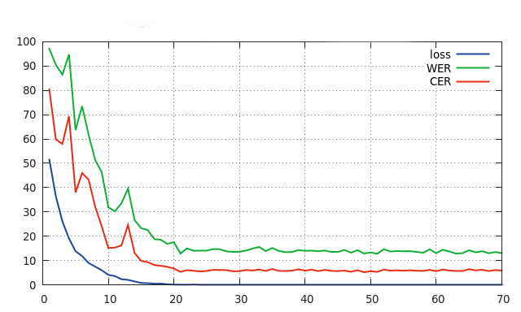

# deepspeech.torch AN4 Phoneme Branch

Implementation of [Baidu Warp-CTC](https://github.com/baidu-research/warp-ctc) using torch7.
Creates a network based on the [DeepSpeech2](http://arxiv.org/pdf/1512.02595v1.pdf) architecture using the Torch7 library, trained with the CTC activation function.

This branch implements Deepspeech2 using phonemes (trained on the AN4 dataset) rather than character based recognition. Was written by [CCorfield](https://github.com/CCorfield) on top of the current implementation
and I thank him so much for his work and effort in bringing phoneme recognition into the repo.

## Features
* Train large models with large datasets via online loading using [LMDB](https://en.wikipedia.org/wiki/Lightning_Memory-Mapped_Database) and multi-GPU support.
* Supports variable length batches via masking.
* Implements the [AN4 Audio database](http://www.speech.cs.cmu.edu/databases/an4/) (50 mins of data).
Has also been extended to train using the [LibriSpeech](http://www.openslr.org/12/) dataset (1000 hours of data). Custom dataset preparation is explained in documentation.

## Branches

There are currently two branches, Master and Phoneme:
* Master: This branch trains DeepSpeech2. Also included is an evaluation script which calculates the WER/CER, as well as a prediction script.
This branch is useful for understanding how the DeepSpeech and CTC works and is easy to run after installation. Highly recommended to checkout this branch.
* Phonemes: This branch is experimental and uses phonemes rather than character based predictions. This is fully credited and extended by [CCorfield](https://github.com/CCorfield) and his awesome work in porting to use phonemes. In addition to this
I'd like to also thank [Shane Walker](https://github.com/walkers-mv) for his awesome recent conversion to use phonemes as well.

## Performance

These results are based on training on the AN4 training set, and testing on the AN4 test set. Will be updated as architecture/datasets changes.

| WER  | CER  |
|:----:|:----:|
| 14   | 4.22 |

## Installation/Data Preparation/Documentation

Follow Instructions/Data Preparation/Documentation found in the wiki [here](https://github.com/SeanNaren/deepspeech.torch/wiki/Installation) to set up and run the code.

Technical documentation can be found [here](http://ctcspeechrecognition.readthedocs.io/en/latest/).

## Acknowledgements

Lots of people helped/contributed to this project that deserve recognition:
* Soumith Chintala for his support on Torch7 and the vast open source projects he has contributed that made this project possible!
* Charles Corfield for his work on the Phoneme Dataset and his overall contribution and aid throughout.
* Will Frey for his thorough communication and aid in the development process.
* Ding Ling, Yuan Yang and Yan Xia for their significant contribution to online training, multi-gpu support and many other important features.
* Erich Elsen and the team from Baidu for their contribution of Warp-CTC that made this possible, and the encouraging words and support given throughout the project.
